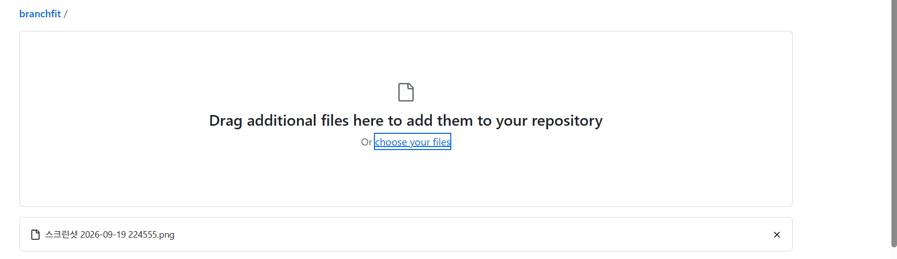

> 📁 **개인 포트폴리오 프로젝트**
> Wanted AI Championship 2026에서 작성한 BranchFit 기획안을 출발점으로, 이후 개인적으로 **Kiro(AI 코딩 에이전트)를 활용해 구현·검증**한 프로젝트입니다.
> 해커톤 제출물이나 수상작이 아니며, IBK기업은행의 공식 서비스도 아닙니다.

# BranchFit

- **데모**: https://branchfit-c7fewtvqdphxpfvsfzt4ws.streamlit.app/
- **스택**: Python · Pandas · Streamlit
- **범위**: 서울 25개 자치구 / IBK 영업점 182개 · `dataset_version 2026-09-19_v4`



---

## 1. 한 줄 요약

은행 담당자가 특정 점포를 검토할 때, **그 점포가 속한 자치구의 공개 데이터로 지역 맥락을 확인**할 수 있게 돕는 검토 보조 프로토타입입니다.
지표 계산은 코드가 하고, AI는 그 결과를 근거·한계와 함께 요약합니다. **통·폐합 여부는 판정하지 않습니다.**

## 2. 문제 정의

점포 통·폐합 검토에는 인구·사업체·점포 분포 같은 외부 데이터가 필요하지만, 출처가 흩어져 있어 한 점포를 볼 때마다 매번 찾아서 정리해야 합니다.

BranchFit은 점포를 선택하면 **소속 자치구의 지역 맥락을 한 화면에 모아** 보여주고, AI가 그 근거와 한계를 요약합니다.

판정 기능은 일부러 넣지 않았습니다. 판정에 필요한 내부 데이터(내점고객 수·이용실적·거래량)가 공개 데이터에 없기 때문입니다. 그래서 이 항목들은 추정하지 않고 **"담당자가 직접 확인할 영역"으로 화면에 명시**합니다.

## 3. 내 역할

- 은행 점포 검토라는 문제 설정과 P0 범위 정의
- 자치구 비교 지표(주지표·보조지표), 상대 라벨 구간, Peer 선정 기준 설계
- **Kiro(AI 코딩 에이전트)를 활용해 Python·Pandas·Streamlit 구현**
- 생성된 코드와 계산 결과 검수, 테스트 결과 확인, 오류 수정 요구 및 병합
- 공식 출처 데이터와 합성 점포명을 분리해 데이터 상태를 표시

구현 커밋은 Kiro가 작성했습니다(`git log`에 `Kiro Agent` 기록이 남아 있습니다).
문제 정의·지표 설계·결과 검수·병합 판단은 직접 수행했습니다.

## 4. 사용 데이터

| 구분 | 항목 | 출처 | 기준시점 |
|---|---|---|---|
| **공식 집계값** | `total_pop`, `elderly_pop` | 행정안전부 주민등록 인구통계 | 2026-07-31 |
| **공식 집계값** | `biz_count` | KOSIS 전국사업체조사 | 2024-12-31 |
| **공식 집계값** | `ibk_branches` | IBK 공식 영업점찾기 | 2026-09-19 |
| **합성값** | `branch_name` (`name_source=synthetic_placeholder`) | — | — |
| **미수집** | 점포 주소·좌표·운영상태·고객 수·실적·거래량·수익성 | — | — |

> **지역 지표는 자치구 집계 데이터를 기반으로 하며, 개별 점포명은 합성 placeholder입니다.**
> 따라서 결과는 개별 점포의 성과가 아니라 **소속 자치구의 지역 맥락**을 의미합니다.
> 같은 자치구의 점포는 모두 같은 지표값으로 표시됩니다.

점포명을 합성값으로 둔 이유: 자치구별 점포 **개수**는 공식 자료로 확인했지만 개별 점포명·주소·운영상태는 검증하지 못했습니다. 검증되지 않은 값을 실제처럼 표시하지 않기 위해 컬럼 자체를 만들지 않고, 점포명은 합성임을 데이터와 화면에 함께 표시했습니다.

### 왜 서울 25개 자치구만인가

- 인천·광주는 행정구역 통합 이슈로 기준 단위가 바뀌어 지역 코드 매핑 오류 위험이 있습니다.
- 부산·대구·울산 등 광역시는 자치구와 군이 섞여 있어, 한 분포에서 percentile을 비교하면 행정단위 동질성이 깨집니다.
- 서울은 25개가 모두 자치구여서 동일한 행정단위끼리 비교할 수 있습니다.
- 같은 방법론은 다른 지역의 구 단위 모집단에도 적용할 수 있습니다.

## 5. 주요 결과 / 화면

점포를 선택하면 순서대로 표시됩니다:
**점포 기본정보 → 지역 맥락 지표 → 자치구 프로필 → Peer 자치구 → AI 브리핑 → 추가 확인 필요영역 → 출처·기준시점·한계**

### 지역 맥락 관찰

- 사업체 1천 개당 IBK 영업점 수는 도봉구(0.04)가 가장 낮고, 금천구(0.291)가 가장 높습니다.
- 사업체 기준 라벨과 인구 기준 라벨이 서로 다른 자치구는 4곳(종로구·성동구·광진구·동작구)입니다.
- 사업체 기준 percentile이 상대 구간 경계에 인접한 자치구는 4곳(성동구·양천구·송파구·강동구)입니다.

두 기준이 엇갈리는 이유는 추론하지 않고, 엇갈린다는 사실만 고정 문구로 표시합니다.

## 6. 핵심 로직

### 지표

```
biz_per_1k  = ibk_branches / biz_count  × 1,000     ← 주지표
pop_per_10k = ibk_branches / total_pop  × 10,000    ← 보조지표
```

주지표를 사업체 기준으로 삼은 이유: 자치구별 사업체 규모 차이가 커서 영업점 **개수**를 그대로 비교하면 규모가 큰 자치구가 항상 많아 보입니다. IBK는 중소기업 대상 은행이라 사업체 수를 분모로 두는 편이 맥락에 맞습니다.

### 상대 라벨

`Series.rank(method="min", pct=True, ascending=True) * 100` 로 percentile을 계산하고, `p ≤ 30` 저밀도 / `30 < p < 70` 중간 / `p ≥ 70` 고밀도로 표시합니다.

- **30/70은 공식 통계·금융당국 기준이 아니라 이 프로젝트의 UI 표현 기준입니다.**
- `method="min"`은 동률일 때 더 낮은 순위를 공유해, 입력 정렬 순서에 따라 값이 흔들리지 않게 합니다.
- percentile이 경계(28–32, 68–72)에 가까우면 **경고가 아닌 중립 배지**로 표시합니다. 라벨만 보고 판단하면 위험하다는 신호입니다.

### Peer

`|총인구 규모 percentile 차| + |사업체 규모 percentile 차|` 가 가장 작은 2곳을 고릅니다.
점포 밀도가 비슷한 곳이 아니라 **규모가 비슷한 비교지역**이며, 우수·열위 지역이 아닙니다.

### AI 구조

```
구조화 입력(JSON) → LLM → 검증 ─통과→ 화면 노출
                            └실패→ 1회 재시도 ─실패→ 결정론적 템플릿 fallback
```

AI는 숫자를 계산하지 않습니다. 계산은 코드가 끝내고 AI는 결과를 설명만 합니다. 검증은 4단계입니다.

| 단계 | 막는 것 |
|---|---|
| 구조 검증 | 필드 누락·타입 오류·허용되지 않은 필드 추가 |
| 수치 대조 | 입력 JSON에 없는 숫자 생성 |
| 고유명 검출 | 입력에 없는 지역명·점포명 |
| 금지표현 | 판정·추천·예측 어법 |

템플릿 fallback은 고정 문구와 입력 수치로만 조립하므로 항상 검증을 통과합니다. → 어떤 상황에서도 화면이 비지 않습니다. LLM을 설정하지 않아도 모든 지표와 브리핑이 정상 표시됩니다.

## 7. 한계

**분석 단위**
- 서울 25개 자치구 내부의 상대 비교이며, 절대적인 충분/부족 기준이 아닙니다.
- 지표는 자치구 단위이므로 같은 자치구 점포는 동일한 값으로 표시됩니다. 개별 점포의 성과·수요 차이를 의미하지 않습니다.
- IBK 영업점만 반영하므로 전체 은행의 금융 접근성을 나타내지 않습니다.
- 인구·사업체·영업점 자료의 기준시점이 서로 다릅니다.

**하지 않는 것**
- 통·폐합 판정·추천, 대상 점포 랭킹
- 금융수요·수익성·거래량 예측, 최적 입지 추천
- 은행 내부 실적 데이터 결합
- 금융위원회 공식 사전영향평가 수행 또는 대체

**검증기의 한계**
- 현재 수치 검증은 입력에 존재하지 않는 숫자의 생성을 제한하는 방식이며, 입력에 존재하는 모든 숫자가 올바른 의미와 문맥으로 사용됐는지까지 보증하는 완전한 의미 검증기는 아닙니다.

## 8. 실행 방법

```bash
pip install -r requirements.txt

python scripts/selfcheck.py   # 데이터 자기점검 (pandas 없이도 동작)
pytest -q                     # 테스트
streamlit run app.py          # 화면
```

LLM 연결은 선택 사항입니다. 설정하지 않으면 결정론적 템플릿 브리핑이 표시됩니다.

```bash
export BRANCHFIT_LLM_API_KEY="..."      # 필수
export BRANCHFIT_LLM_BASE_URL="..."     # 생략 가능 (OpenAI 호환 엔드포인트)
export BRANCHFIT_LLM_MODEL="..."        # 생략 가능
```

### 코드 구조

```
app.py                 Streamlit 화면
branchfit/
  config.py            고정 상수 (임계값·고정문구·출처·금지표현)
  data.py              CSV 로딩 + 정합성 검증
  metrics.py           지표·percentile·라벨·경계 판정
  peers.py             Peer 자치구 선정
  review.py            검토 사유·추가 확인 영역 선정
  contract.py          AI 입력 JSON      ← 여기부터 pandas 없음
  validator.py         AI 출력 검증 4단계
  briefing.py          LLM 호출 + 템플릿 fallback
  pipeline.py          조립부
scripts/selfcheck.py   의존성 없는 데이터·가드레일 점검
tests/                 계산식 · Peer · 가드레일
```

pandas를 쓰는 계산 레이어와 표준 라이브러리만 쓰는 AI·검증 레이어를 나눴습니다. 검증기가 마지막 안전장치라 의존성을 최소로 두어, pandas·streamlit이 없는 환경에서도 가드레일만 따로 테스트할 수 있습니다.

## 9. 검증

`dataset_version 2026-09-19_v4` 기준으로 **직접 실행해 확인한 결과**입니다. (CI 자동 검증은 구성하지 않았습니다.)

```
python scripts/selfcheck.py        → 25/25 PASS
pytest tests/test_guardrails.py    → 24 passed
```

`selfcheck.py`는 percentile과 Peer를 표준 라이브러리로 독립 재구현해 교차검증합니다. pandas의 결과를 pandas로 다시 확인하는 것은 검증으로서 의미가 약하기 때문입니다.

주요 확인 항목:

```
자치구 25행 · region_code 중복 없음 · IBK 합계 182 · 점포 182행
자치구별 점포 수 == ibk_branches · biz_per_1k 동률 없음
상대 라벨 분포 저7/중10/고8 · Peer 각 2곳 · Peer 결정성(입력 순서 무관)
182개 전 점포 템플릿 브리핑 검증 통과
[음성] 없는 숫자·지역명·점포명 차단 / 판정·추천·수익성·예측 표현 차단
```

공식 데이터 반영 시 자치구별 집계 합계가 기획안에 기록해 둔 **182개와 일치**했습니다.
