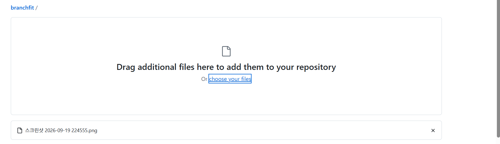

> **보완 중 프로토타입 / 현업 검증 전**
> 필수 보완과 증빙 확인 전에는 완성 프로젝트로 이력서·지원서에 기재하지 않습니다.
> Wanted AI Championship 2026에서 작성한 BranchFit 기획안을 출발점으로, 이후 개인적으로 **Kiro(AI 코딩 에이전트)를 활용해 구현·검증**한 프로젝트입니다.
> 해커톤 제출물이나 수상작이 아니며, IBK기업은행의 공식 서비스도 아닙니다.

# BranchFit

- **기존 데모**: https://branchfit-c7fewtvqdphxpfvsfzt4ws.streamlit.app/ (이번 로컬 보완의 배포 여부는 확인 전)
- **스택**: Python · Pandas · Streamlit
- **범위**: 서울 25개 자치구 / 공공 CSV 기준 고정 영업점 181개 · `dataset_version 2026-10-08_v5`



---

## 1. 한 줄 요약

[가설] 은행 담당자가 특정 점포를 검토할 때, **그 점포가 속한 자치구의 공개 데이터로 지역 맥락을 확인**할 수 있게 돕는 검토 보조 프로토타입입니다.
지표 계산은 코드가 하고, AI는 그 결과를 근거·한계와 함께 요약합니다. **통·폐합 여부는 판정하지 않습니다.**

## 2. 문제 정의

[가설] 공개 데이터의 출처를 모아 점포 소재지의 지역 맥락을 정리하는 업무가 있을 것으로 가정합니다. 현업 인터뷰나 사용성 검증은 아직 수행하지 않았습니다. 시간 절감 효과·도입 의사·실제 수요는 검증 전이며, 인터뷰 인용은 없습니다.

BranchFit은 점포를 선택하면 **소속 자치구의 지역 맥락을 한 화면에 모아** 보여주고, AI가 그 근거와 한계를 요약합니다.

판정 기능은 일부러 넣지 않았습니다. 판정에 필요한 내부 데이터(내점고객 수·이용실적·거래량)가 공개 데이터에 없기 때문입니다. 그래서 이 항목들은 추정하지 않고 **"담당자가 직접 확인할 영역"으로 화면에 명시**합니다.

## 3. 내 역할

- 은행 점포 검토라는 문제 설정과 P0 범위 정의
- 자치구 비교 지표(주지표·보조지표), 상대 라벨 구간, Peer 선정 기준 설계
- **Kiro(AI 코딩 에이전트)를 활용해 Python·Pandas·Streamlit 구현**
- 생성된 코드와 계산 결과 검수, 테스트 결과 확인, 오류 수정 요구 및 병합
- 공공 CSV 점포명·주소를 사용하고 출처·시점·미검증 항목을 표시

구현 커밋은 Kiro가 작성했습니다(`git log`에 `Kiro Agent` 기록이 남아 있습니다).
문제 정의·지표 설계·결과 검수·병합 판단은 직접 수행했습니다.
2026-10-08 공공 CSV 교체·거리 예외 처리·PDF·표시 보완은 Codex 지원으로 작성한 로컬 변경입니다. 작성 지원과 본인의 검수·의사결정을 구분합니다.

## 4. 사용 데이터와 범위

| 항목 | 출처 | 기준시점 | 상태 |
|---|---|---|---|
| 인구·65세 이상 인구 | 기존 행정안전부 주민등록 인구통계 값 | 2026-07-31 | 기존 값 유지 |
| 사업체 수 | 기존 KOSIS 전국사업체조사 값 | 2024-12-31 | **시군구 확정 통계표 대조 필요** |
| 점포명·주소·구별 점포 수 | 공공데이터포털 15006875 점포명세 CSV | 2025-12-31 | 원본 CSV 기반 |
| 좌표·거리 | 키가 있을 때 주소 변환, 세션 메모리만 사용 | 실행 시 | 키 없음·실패 시 좌표 미확인 |

원본 점포명세 629행 중 서울 185행을 선택했습니다. 기업금융센터 3곳과 이동점포 1곳을 제외한 **고정 점포 표본 181행**이며 출장소 4곳을 포함합니다. ATM 별도 파일은 사용하지 않았습니다. 이 표본은 서울의 현재 운영 중인 모든 영업점을 실시간 확인한 결과가 아닙니다.

기존 182행과 구별 집계가 달라 기존 값에 맞추지 않았습니다. 금천구 14→13, 서초구 15→14, 강남구 23→24로 집계를 교체했습니다. 이는 **출처·시점·표본 기준 차이**이며 실제 폐쇄·신설을 입증하지 않습니다.

원본, SHA-256, 제외 행, 집계 차이는 `data/source/manifest.json`에 기록합니다. 재생성: `python scripts/import_official_branches.py`. 좌표 컬럼·좌표 파일·API 키는 커밋하지 않습니다.

**범위는 서울 25개 자치구로 고정합니다. 2026-10-08 사용자 결정으로 대구는 제외했습니다.** 다른 지역 비교나 전국 운영을 구현한 것으로 설명하지 않습니다.

## 5. 화면과 산출물

- 기본정보: 실제 점포명·주소와 원본 기준시점
- 거리: 좌표 확보 시 점포명·km(직선거리), 미확보 시 좌표 미확인
- 근거 / 한계 / 추가 확인 카드 분리
- AI 또는 결정론적 템플릿 모드 표시
- **A4 한 장 검토 참고 자료 PDF**: 기본정보·지역 지표·거리 상태·요약·한계·추가 확인·출처·시점
- PDF는 현재 결과를 요약한 참고 자료이며 판정·추천·성과 보증을 제공하지 않습니다.
- **디자이너 시안 반영 전**입니다. 카드 분리는 구현됐지만 발표용 UX 완료로 표시하지 않습니다.

## 6. 핵심 로직

### 지표

```
biz_per_1k  = ibk_branches / biz_count  × 1,000     ← 주지표
pop_per_10k = ibk_branches / total_pop  × 10,000    ← 보조지표
```

주지표를 사업체 기준으로 삼은 이유: 자치구별 사업체 규모 차이가 커서 영업점 **개수**를 그대로 비교하면 규모가 큰 자치구가 항상 많아 보입니다. IBK는 중소기업 대상 은행이라 사업체 수를 분모로 두는 편이 맥락에 맞습니다.

### 상대 라벨

`Series.rank(method="min", pct=True, ascending=True) * 100` 로 percentile을 계산하고, `p ≤ 30` 저밀도 / `30 < p < 70` 중간 / `p ≥ 70` 고밀도로 표시합니다.

- **30/70은 공식 통계·금융당국 기준이 아니라 이 프로젝트의 UI 표현 기준입니다.**
- `method="min"`은 동률일 때 더 낮은 순위를 공유해, 입력 정렬 순서에 따라 값이 흔들리지 않게 합니다.
- percentile이 경계(28–32, 68–72)에 가까우면 **경고가 아닌 중립 배지**로 표시합니다. 라벨만 보고 판단하면 위험하다는 신호입니다.

### Peer

`|총인구 규모 percentile 차| + |사업체 규모 percentile 차|` 가 가장 작은 2곳을 고릅니다.
점포 밀도가 비슷한 곳이 아니라 **규모가 비슷한 비교지역**이며, 우수·열위 지역이 아닙니다.

### AI 구조

```
구조화 입력(JSON) → LLM → 검증 ─통과→ 화면 노출
                            └실패→ 1회 재시도 ─실패→ 결정론적 템플릿 fallback
```

AI는 숫자를 계산하지 않습니다. 계산은 코드가 끝내고 AI는 결과를 설명만 합니다. 검증은 4단계입니다.

| 단계 | 막는 것 |
|---|---|
| 구조 검증 | 필드 누락·타입 오류·허용되지 않은 필드 추가 |
| 수치 대조 | 입력 JSON에 없는 숫자 생성 |
| 고유명 검출 | 입력에 없는 지역명·점포명 |
| 금지표현 | 판정·추천·예측 어법 |

템플릿 fallback은 고정 문구와 입력 수치로만 조립하므로 항상 검증을 통과합니다. → 어떤 상황에서도 화면이 비지 않습니다. LLM을 설정하지 않아도 모든 지표와 브리핑이 정상 표시됩니다.

## 7. 한계

**분석 단위**
- 서울 25개 자치구 내부의 상대 비교이며, 절대적인 충분/부족 기준이 아닙니다.
- 지표는 자치구 단위이므로 같은 자치구 점포는 동일한 값으로 표시됩니다. 개별 점포의 성과·수요 차이를 의미하지 않습니다.
- IBK 영업점만 반영하므로 전체 은행의 금융 접근성을 나타내지 않습니다.
- 인구·사업체·영업점 자료의 기준시점이 서로 다릅니다.

**하지 않는 것**
- 통·폐합 판정·추천, 대상 점포 랭킹
- 금융수요·수익성·거래량 예측, 최적 입지 추천
- 은행 내부 실적 데이터 결합
- 금융위원회 공식 사전영향평가 수행 또는 대체

**검증기의 한계**
- 현재 수치 검증은 입력에 존재하지 않는 숫자의 생성을 제한하는 방식이며, 입력에 존재하는 모든 숫자가 올바른 의미와 문맥으로 사용됐는지까지 보증하는 완전한 의미 검증기는 아닙니다.

## 8. 실행 방법

```bash
pip install -r requirements.txt

python scripts/selfcheck.py   # 데이터 자기점검 (pandas 없이도 동작)
python -m pytest -q                     # 테스트
streamlit run app.py          # 화면
```

LLM 연결은 선택 사항입니다. 설정하지 않으면 결정론적 템플릿 브리핑이 표시됩니다.

```bash
export BRANCHFIT_LLM_API_KEY="..."      # 필수
export BRANCHFIT_LLM_BASE_URL="..."     # 생략 가능 (OpenAI 호환 엔드포인트)
export BRANCHFIT_LLM_MODEL="..."        # 생략 가능
```

### 코드 구조

```
app.py                 Streamlit 화면
branchfit/
  config.py            고정 상수 (임계값·고정문구·출처·금지표현)
  data.py              CSV 로딩 + 정합성 검증
  metrics.py           지표·percentile·라벨·경계 판정
  peers.py             Peer 자치구 선정
  review.py            검토 사유·추가 확인 영역 선정
  contract.py          AI 입력 JSON      ← 여기부터 pandas 없음
  validator.py         AI 출력 검증 4단계
  briefing.py          LLM 호출 + 템플릿 fallback
  pipeline.py          조립부
  report.py            한글 폰트를 포함한 A4 참고 자료 PDF
assets/fonts/          Nanum Gothic 및 SIL OFL 라이선스
scripts/selfcheck.py   의존성 없는 데이터·가드레일 점검
tests/                 계산식 · Peer · 가드레일
```

pandas를 쓰는 계산 레이어와 표준 라이브러리만 쓰는 AI·검증 레이어를 나눴습니다. 검증기가 마지막 안전장치라 의존성을 최소로 두어, pandas·streamlit이 없는 환경에서도 가드레일만 따로 테스트할 수 있습니다.

## 9. 검증과 남은 조건

기존 테스트와 보완 테스트를 함께 실행합니다. 통과 수는 실행 로그를 기준으로 기록하며 테스트 통과를 현업 검증·수상·채용 결과로 해석하지 않습니다.

```bash
pip install -r requirements-dev.txt
python -m pytest -q
python scripts/selfcheck.py
```

미완료 조건:
- 사업체 시군구 확정 통계표 대조 및 출처 확정
- 현업 니즈 인터뷰 및 사용성 검증 (현재는 가설)
- 디자이너 시안 적용·검수
- 마이AI랩 기존 프로젝트 사용·제출 규정 확인
- 실제 API 연결·실제 거리 확인 (네트워크 없는 회귀 테스트와 구분)

보완 내역과 상태는 `docs/NEXT_STEPS.md`를 참조합니다.
